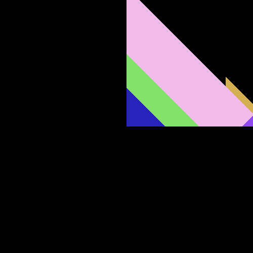
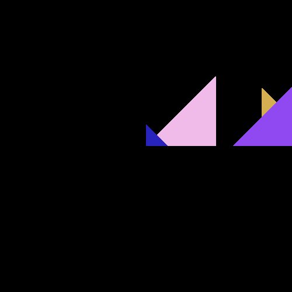
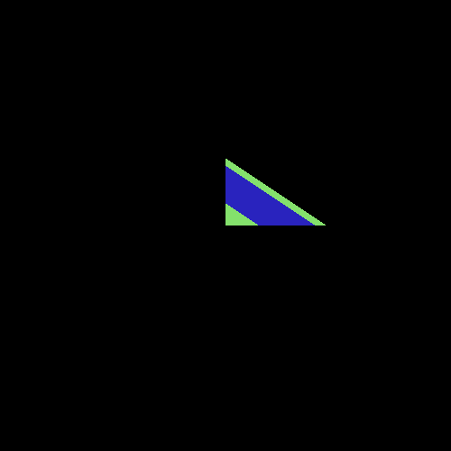

# Computer Graphics Sessional (OpenGL & C++)

This repository contains projects from my computer graphics sessional, implemented using OpenGL and basic C++ for rasterization and ray tracing.

## Problem-1: OpenGL Implementation  

### 📌 Setup Instructions  
Refer to the setup guide:  
[Setup Guide](./Setting Up OpenGL.pdf)  

### 📚 Documentation  
For further details on the implementation and concepts, refer to the documentation:  
- [Documentation 1](./glut-3.spec.pdf)  
- [Documentation 2](./redbook.pdf)  
  
[Problem Specification](./Offline-1/Specification.pdf)  
[My Solution](./Offline-1/1905088/)  

### 🎥 Demonstration  

<table align="center">
  <tr>
    <td align="center">
      
       <b>Rolling Ball</b>
    </td>
    <td align="center">
      
       <b>Magic Cube</b>
    </td>
  </tr>
</table>

## Problem-2: Rasterization

[Problem Specification](./Offline-2/Offline-2_Specifications.pdf)  
[My Solution](./Offline-2/1905088)

### 🎥 Demonstration 

<table>
  <tr>
    <td align="center">
      
       <b>Result 1</b>
    </td>
    <td align="center">
      
       <b>Result 2</b>
    </td>
    <td align="center">
      
       <b>Result 3</b>
    </td>
    <td align="center">
      
       <b>Result 4</b>
    </td>
    <td align="center">
      
       <b>Result 5</b>
    </td>
  </tr>
</table>

